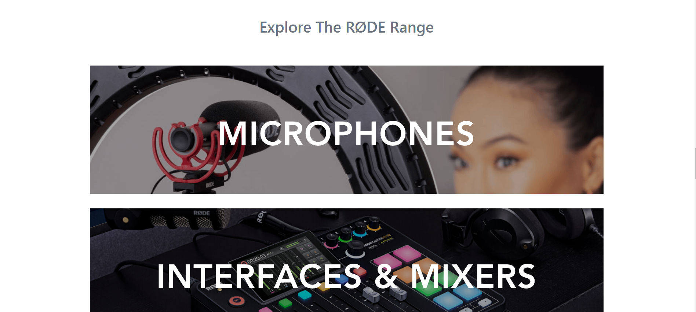

# _Hello I'm AMAR_

## What I have learn ? 

- HTML 5 Tags and Elements
- CSS 3 Properties and usages of position 
- cards
- responsiveness
- Flex
- media queries
- Tailwind* {TailWind makes life easy.}
  
## Estimated time I took to complete this
    - 14 and a half hour

## _Here Is What I'm Working On👨‍💻_

  💻 I’m currently learning  ...<strong>Full Stack Javascript Web Developer By [Hitesh Choudhary](https://github.com/hiteshchoudhary).🔥✨🚀</strong>

 
## 🤝 _Connect With Me:_  

 

 ## _Visitors Count_ 
  
